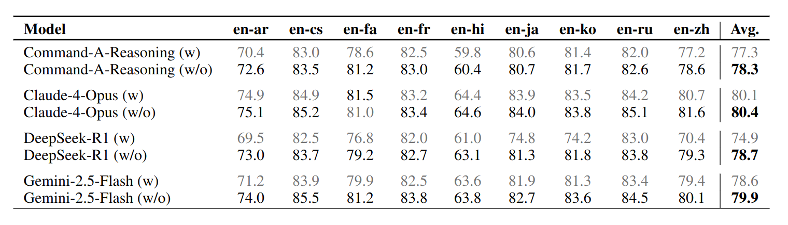
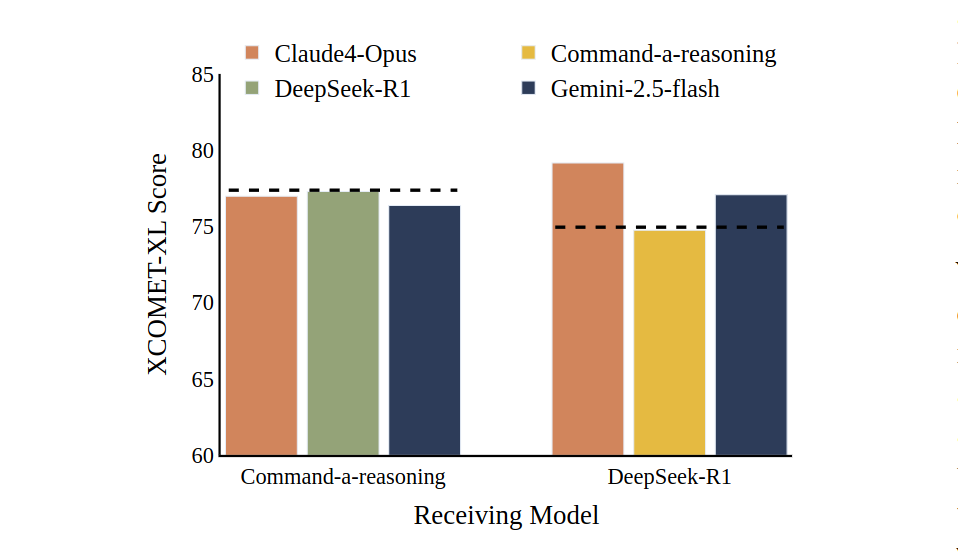
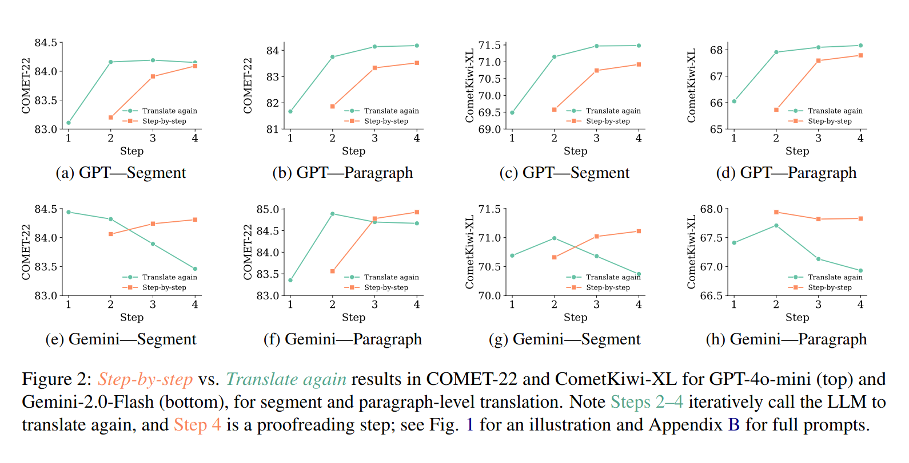

LLM reasoning has a simple appeal: give the model more room to think, and the answer should improve. That intuition works well enough in domains like math, coding, and planning that it is tempting to apply it everywhere.

Machine translation seems like an obvious candidate. Translation is not just word substitution: a good translator resolves ambiguity, preserves tone, chooses between literal and idiomatic phrasing, and revises awkward drafts. Surely a model that “reasons” before translating should do better.

The recent evidence says that's not always the case.

## Thinking damages the translation quality

The most evident proof of this effect comes from Rajaee et al., [_Unlocking Reasoning Capability on Machine Translation in Large Language Models_](https://arxiv.org/pdf/2602.14763). They compare several reasoning-oriented LLMs on translation tasks with and without explicit reasoning.

The result is counterintuitive: the models generally do **better without reasoning**. In their WMT24++ evaluation, every tested reasoning model has a higher average quality score when reasoning is disabled. DeepSeek-R1 shows the most dramatic gap: **78.7 without reasoning** versus **74.9 with reasoning**. Command-A-Reasoning, Claude-4-Opus, and Gemini-2.5-Flash show the same direction, although with smaller gaps.

_Table 1 from Rajaee et al, showing the inverse gap between reasoning and non-reasoning translation quality._

This is a useful counterpoint to a common assumption about LLMs. Reasoning doesn't always improve outcomes. Reasoning should be seen as a behavior, and it can be badly matched to the task while being a perfect fit for another.

But why reasoning is unfit for this task? The problem is that generic LLM don't reason like a translator would. The authors find that the reasoning traces are mostly linear: the model walks through the sentence, translates pieces in order, and rarely revisits earlier decisions or considers alternatives. That is not how difficult translation usually works. A translator may try one phrasing, reject it as too literal, adjust the tone, change the sentence structure, then re-check whether the meaning survived. The important part is the constant revision of past translation choices, something that the LLM doesn't ever seem to do while reasoning about a piece. Their reasoning process was not trained for translation, so it doesn't not apply well to it.

_Table 2 shows the number of reasoning paths taken, which is remarkably low in comparison to the process of a human translator._

The same paper also tests whether stronger models can donate better reasoning traces to weaker ones. This sounds plausible: let a strong model think, then let another model use that reasoning to translate. However, the results are still inconsistent: better reasoning traces do not reliably produce better translations.

_Figure 1 From Reajaee et al. shows the performance of open-weights models when their reasoning traces are generated and injected from other models. The dash-line represents the baseline performance of the receiving models, and the injecting models are presented at the top. This figure shows how the strength of the injecting model used to generate reasoning traces does not always correlate with final translation quality across different injecting and receiving models._

That failure suggests that the issue is not merely the quality of the reasoning text. The issue is the _shape_ of the reasoning process itself, regardless of the intelligence or size of the model in question.

## The revision step

A second line of work points in the same direction from another angle. In [_Please Translate Again_](https://aclanthology.org/2025.emnlp-main.1031.pdf), Wu et al. ask whether elaborate step-by-step translation prompts are really helping because of their human-like decomposition.

Their answer is skeptical. Simple refinement (essentially just asking the model to translate again) can **match or outperform more elaborate step-by-step prompting**, but it's highly inconsistent across models. That does not mean the richer prompt is useless, but it weakens the idea that explicit pre-translation reasoning is the key ingredient.

This is an important distinction for LLM users in general. A multi-step prompt may work not because the model has produced a faithful mental plan, but because the prompt gives it another chance to revise. In translation, that second pass is often more valuable than the explanation around it.

Li et al make a related point in their work on test-time scaling for reasoning models in translation. Giving models more reasoning budget does not reliably improve first-pass translation. In some cases, forcing a model to keep reasoning after it would naturally stop makes the output worse. But extra compute is more useful for **post-editing**: give the model an existing translation to improve, and the token budget that would be otherwise wasted on aimless reasoning on the first draft can be used productively for review.

Overall, it seems that LLM's translation quality is not helped by free-form thought, but by feedback loops: draft, inspect, revise.

## Lesson learned

This lesson is not specific to machine translation.

Many LLM workflows assume that adding chain-of-thought reasoning creates a better system. Translation is a useful counterexample because quality depends heavily on the final surface form and more intermediate text can introduce drift, overthinking, literalism, or unnecessary changes. A fluent final answer is much more important than a verbose internal explanation.

This is especially important when applying LLMs to domains where assessing the quality of the final output is not cheap and would usually require a human. By letting the model review, or by structuring its thinking in a more explicit way to match human processes, the output quality should become much easier to interpret and trust, and therefore more valuable.
