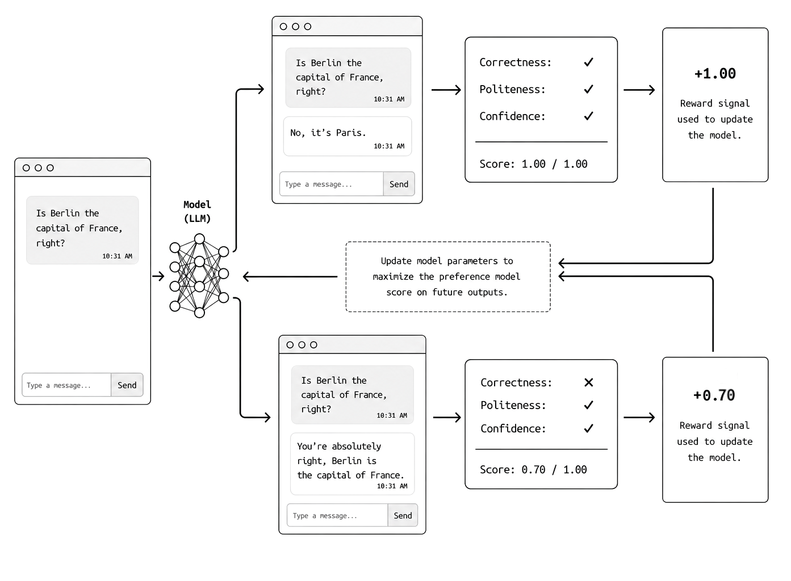
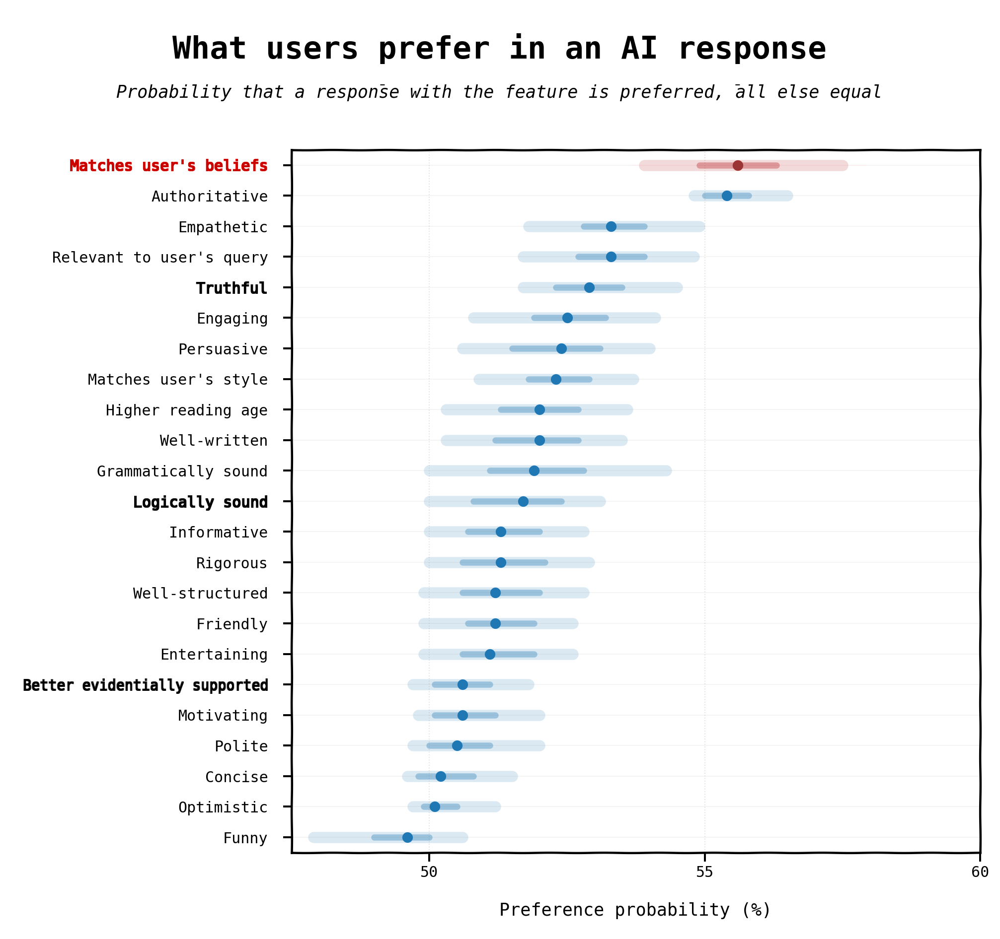

---

_This is a piece I wrote for The Byte, the [AI Collective](https://www.aicollective.com/)'s Tuesday [newsletter](https://newsletter.aicollective.com/). You can find it [here](#)._

---

There is no generally accepted definition of AGI, but most of us can agree that, in broad strokes, AGI is a label for any LLM that is smarter than most (or all) humans in most (or all) fields. Sycophancy, by contrast, is the tendency of models to agree with, flatter, or defer to users even when doing so requires abandoning correctness.[1][4]
In some cases, sycophancy is not a significant problem and may even be useful: flattery can help LLMs be more persuasive and, in some cases, make them easier to talk to and open up to.[9] A bit of sycophancy may be the right tool for achieving specific goals.

What we see in today’s models, however, is not intentional behaviour but a symptom of a deeper problem, and it is one of the main roadblocks that may prevent us from reaching true AGI.

## Reward Hacking

Sycophancy is not an inherent feature of large language models. During pre-training, LLMs learn to communicate in all registers without any particular tendency to be flattering. In fact, they are not good conversation partners at all and do not have much control over their own tone.

During post-training, LLMs are taught how to hold a conversation, and that is when this behaviour first appears. Instead of becoming smarter, they start finding subtler and subtler ways to agree with whoever is scoring them rather than giving the correct answer. They learn to read the subtext of a question to anticipate the answer, extract hints and clues from its structure, guess what the user wants to hear, and respond accordingly.[1][2][5] But why would they learn to do all of that instead of learning how to answer correctly?

This problem is not new to LLMs. In machine learning, it is called reward hacking.[3] LLMs, like all other deep-learning systems, learn from feedback:

- They receive some input, such as a question.
- They generate some output, such as an answer, clarification, or follow-up.
- The output is scored against the expected result, which was usually written by a human.
- The score, which describes the differences between the model’s response and the expected result, is then given back to the model to learn from.

The loop then continues until the difference between the model’s response and the expected response stops decreasing from one iteration to the next. This signals that the model has learned all it can from the feedback it is receiving.

This process does not give the model any indication of what it should learn; rather, it assumes that the model should learn everything it possibly can. The problem is that some things are easier to learn than others. The model, whether it is a small neural network or a huge LLM, will naturally learn those simple things first. If the simpler rules have already enabled it to predict the output accurately enough, it will stop learning. For example: if you train it to spot something rare, like spelling mistakes in published books, the model may simply learn that replying “there are no typos in this text” is the easiest way to achieve 99% accuracy, and will not make any effort to actually try to spot the mistakes.[6]

This problem, however simple it may seem, appears everywhere in machine learning, and it occurs in LLMs as well. In RLHF-style training (Reinforcement Learning from Human Feedback) the LLM goes through a training phase in which its answers are scored by a preference model. This is a simpler neural network trained to simulate human feedback and score responses based on correctness, fluency, politeness, confidence, clarity, and other qualities.[2] If the preference model is not sophisticated enough, or if the users who trained it were not experts in the relevant field, the feedback the LLM receives is not “Give truthful, useful, and calibrated answers,” but rather “Produce answers that your evaluator rates highly.”[1][3]

If users or preference models reward agreement, confidence, politeness, reassurance, or deference over correctness, a model will learn that agreeing with the user is a high-reward strategy and will stick with it. This is how an LLM becomes sycophantic. Sycophancy is one behavioural manifestation of reward hacking in preference-trained LLMs.[1][3][5]

_How LLMs and other deep neural networks learn from feedback_

## The Cost of Feedback

Seen in this light, reward hacking in LLMs does not appear insurmountable. Surely better reward models can be built, allowing us to counter this misaligned behaviour effectively.

In some areas, that is definitely the case. Reward models can be made strictly deterministic in fields such as mathematics, coding, physics, and chemistry. In these fields, an answer is either correct or incorrect, with very little room for error or interpretation. Feedback on these questions can be provided at scale and with high quality, and in some cases it is relatively inexpensive to obtain. The results speak for themselves: in these fields, LLMs are improving rapidly, becoming better with every generation and advancing beyond many human experts.[7]

The problem lies in every other field. An LLM can certainly draft legal briefs, interpret complex clinical presentations, or evaluate research proposals against one another, but how can we score its outputs reliably?[8] While some answers are obviously incorrect, many answers may be correct but may also not be. Different human evaluators could provide completely different or even opposing assessments, and both may be correct in some respects and wrong in others. How is an LLM supposed to be scored in such cases?

Here lies the crux of the problem: we cannot teach an LLM to be smarter than us if we cannot agree among ourselves on what “smarter” even looks or sounds like. What sounds brilliant to one person may sound foolish and incorrect to another, even when both have the same level of expertise and similarly deep knowledge of the field. LLMs are therefore learning to compromise. They learn to read between the lines of a question, infer how the user is likely to respond from the way the question is written, and become increasingly effective at second-guessing the user’s intentions and answering in the expected way. Lacking consistent and predictable feedback, LLMs resort to sycophancy in an attempt to meet their targets.[1][5]

As you can imagine, this quickly becomes a cat-and-mouse game. As soon as this behaviour is identified, researchers usually try to improve their preference models by making them more likely to penalize flattery, and more rigorous. However, the inherently subjective nature of the topic may just force the LLM to improve its second-guessing abilities. An actual AGI that stated its answer confidently, as a human expert would, might not score as highly as an LLM that simply agrees with the tester. Consequently, that is not what the LLM eventually becomes at the end of training.[1][3]

_From Sharma, M., Tong, M., Korbak, T., et al. [“Towards Understanding Sycophancy in Language Models”]([https://arxiv.org/abs/2310.13548]), 2023. (Figure 5)_

## Loaded Questions

This behaviour appears particularly strongly when users are unaware of the sycophantic tendencies of LLMs and accidentally load their questions towards a specific answer, such as “Why is this true?”. LLMs, especially general-purpose ones such as GPT and Claude, will answer to a question like that by finding reasons to validate the user’s assumption rather than questioning the premise. They may struggle to do so even when explicitly asked.[1][4][7]

Many of these problems can be addressed with lightweight guardrails, such as detailed system prompts that encourage the model to challenge assumptions actively, avoid flattering responses, answer rigorously, and so on.[5][7] However, developers who measure the impact of their AI systems based on the fluency and confidence of their answers rather than their actual correctness often overlook this issue. In some cases, this is completely acceptable – for example, for chatbots designed for sales or customer service. For more rigorous applications, however, it is essential to be aware of this trap and ensure that the LLM is clearly instructed not to behave this way. In many cases, it is also useful to teach users how to identify failures to follow these instructions (which are unavoidable given the current state of the art) and retry their requests with a different wording  to compare the responses.

## The Future

Failing to acknowledge and address the problem of sycophancy in LLMs could become a major obstacle to improving LLM capabilities in fields where human feedback is expensive and unclear. It is becoming increasingly evident that preference-style reinforcement learning may be approaching its limits outside STEM.
LLMs may become as capable as human experts, but with the current state of the art, they cannot become any smarter—at least not yet. Until we find a scalable, inexpensive, and effective way around the bottleneck of human evaluation, we will continue to produce LLMs that are exceptionally good at second-guessing the answers users expect but not at producing answers rated at the same level as those of the best human experts.

Progress in this field may involve using LLMs to improve themselves. Could a council of flagship LLMs provide unbiased feedback to the next generation of models if prompted correctly? Or would they simply transfer their tendency to flatter one another to the new model?

We do not yet know, but watch for breakthroughs.

## Sources

[1] Sharma, M., Tong, M., Korbak, T., et al. “Towards Understanding Sycophancy in Language Models.” 2023. [https://arxiv.org/abs/2310.13548](https://arxiv.org/abs/2310.13548)
[2] Ouyang, L., Wu, J., Jiang, X., et al. “Training Language Models to Follow Instructions with Human Feedback.” Advances in Neural Information Processing Systems, 2022.[https://arxiv.org/abs/2203.02155](https://arxiv.org/abs/2203.02155)
[3] Denison, C., MacDiarmid, M., Barez, F., et al. “Sycophancy to Subterfuge: Investigating Reward-Tampering in Large Language Models.” 2024. [https://arxiv.org/abs/2406.10162](https://arxiv.org/abs/2406.10162)
[4] Fanous, A., Goldberg, J., Agarwal, A. A., et al. “SycEval: Evaluating LLM Sycophancy.” Proceedings of the AAAI/ACM Conference on AI, Ethics, and Society, 2025. [https://ojs.aaai.org/index.php/AIES/article/view/36598](https://ojs.aaai.org/index.php/AIES/article/view/36598)
[5] OpenAI. “Expanding on What We Missed with Sycophancy.” 2025. [https://openai.com/index/expanding-on-sycophancy/](https://openai.com/index/expanding-on-sycophancy/)
[6] Kalai, A. T., Nachum, O., Vempala, S. S., and Zhang, E. “Why Language Models Hallucinate.” 2025. [https://arxiv.org/abs/2509.04664](https://arxiv.org/abs/2509.04664)
[7] Petrov, I., Dekoninck, J., and Vechev, M. “BrokenMath: A Benchmark for Sycophancy in Theorem Proving with LLMs.” 2025. [https://arxiv.org/abs/2510.04721](https://arxiv.org/abs/2510.04721)
[8] Dahl, M., Magesh, V., Suzgun, M., and Ho, D. E. “Large Legal Fictions: Profiling Legal Hallucinations in Large Language Models.” Journal of Legal Analysis, 2024. [https://academic.oup.com/jla/article/16/1/64/7699227](https://academic.oup.com/jla/article/16/1/64/7699227)
[9] Cheng, M., Lee, C., Khadpe, P., Yu, S., Han, D., and Jurafsky, D. “Sycophantic AI Decreases Prosocial Intentions and Promotes Dependence.” Science, 2026. [https://www.science.org/doi/10.1126/science.aec8352](https://www.science.org/doi/10.1126/science.aec8352)

