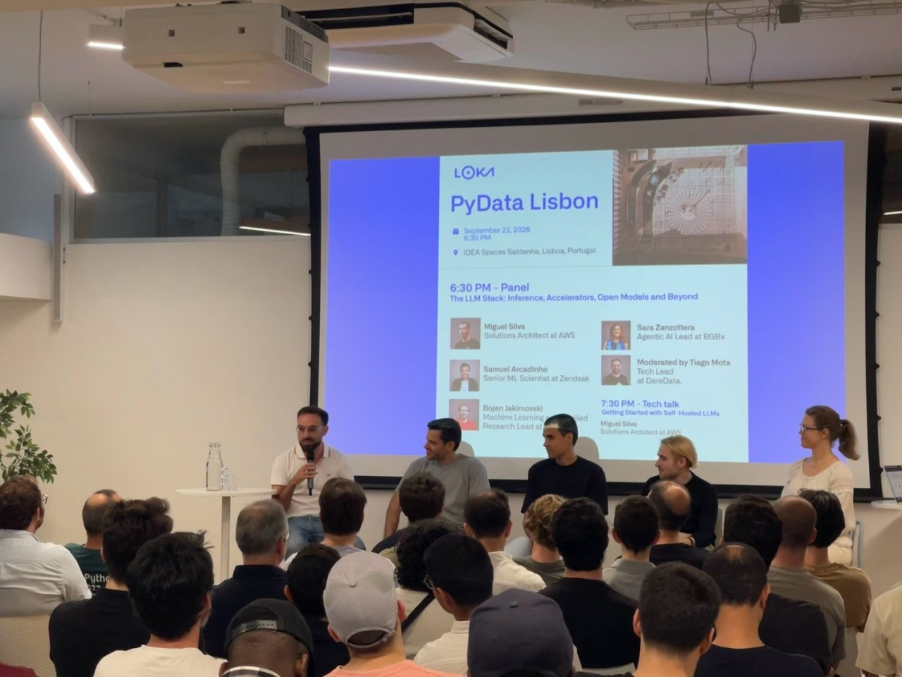

[Announcement](https://www.meetup.com/pydata-lisbon/events/316579913/), [event pictures](https://drive.google.com/drive/folders/1OrxwE3UjQet0-ge8Exz9oY6qmtEW8gvo?usp=drive_link).

---

The 19th PyData Lisbon Meetup (part of the 2026 [Lisbon AI Week](https://lisbonaiweek.com)) was a special edition about AI infrastructure, with a panel titled "The LLM Stack: Inference, Accelerators, Open Models and Beyond". 

During the panel we touched several points about LLM inference infrastructure: we debunked some common misconceptions, discussed tradeoffs between pay-as-you-go hosted models, rented GPUs, all the way down to edge computing and distributed inference, we talked about the different decisions you may have to take depending on your industry's specific requirements, from small startups to highly regulated industries, weighted the pros and cons of model fine-tuning, but also talked about determinism in LLMs and how far you can reasonably bring it for real production use-cases.

